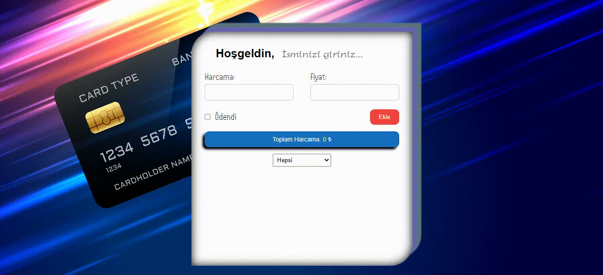

# Harcama Hesaplama Motoru

Bu proje, kullanıcıların harcamalarını kolayca hesaplayabilecekleri bir hesaplama motorudur. Projede, sık ve responsiv tasarım, harcamaların eklenmesi, ödeme durumunun belirtilmesi, toplam harcamaların görüntülenmesi ve LocalStorage kullanımı gibi özellikler bulunmaktadır. 

## Nasıl Çalıştırılır?

1. Bu projeyi klonlayın veya indirin.
2. Terminali açın ve proje klasörüne gidin:
3. Proje klasöründe `index.html` dosyasını bir web tarayıcısında açarak uygulamayı çalıştırın.

## Kullanım

1. Sayfa açıldığında, "Ürün Adı" ve "Fiyat" alanlarını doldurarak harcamalarınızı ekleyin.
2. "Ekle" butonuna tıklayarak harcamayı kart olarak ekleyin.
3. İnputların altında, harcanan miktarın ödendiğini belirtmek için "Ödendi"  tıklayın.
4. Yapılan tüm harcamaların toplamını görmek için sayfanın ortasındaki toplam tutar alanını kontrol edin.
5. Harcama yapan kişi bilgisi otomatik olarak LocalStorage'a kaydedilir ve sayfa yeniden açıldığında görüntülenir.
6. Hızlı işlemler için kartların sol tarafındaki "Ödendi" ve "Sil" butonlarını kullanabilirsiniz.

## Teknolojiler ve Kütüphaneler

Bu projede aşağıdaki teknolojiler ve kütüphaneler kullanılmıştır:

- HTML
- CSS
- JavaScript
- LocalStorage

